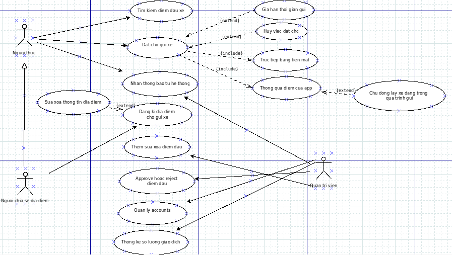
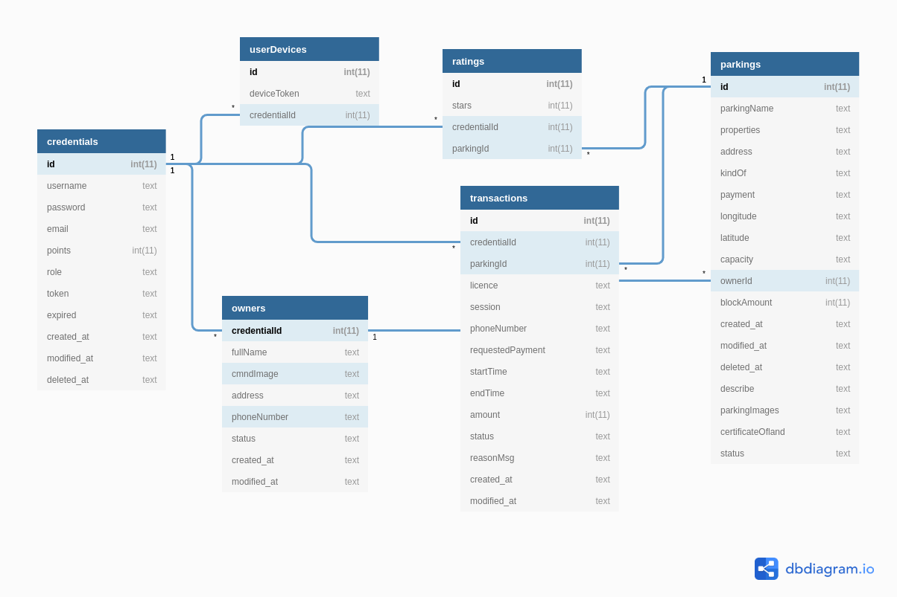

# Parking_to_easy
### Hỗ trợ tìm kiếm và chia sẻ bãi đỗ xe thông minh
###Đặt vấn đề
. Bãi đỗ xe trong khu vực nội đô bố trí chưa hợp lý và còn thiếu
. Hà nội mới chỉ đáp ứng được 8 - 10 % nhu cầu đỗ xe của người dân, đất dành cho các bãi đỗ xe chỉ chiếm khoảng 0.12 % tổng diện tích khu vực, nhiều bãi đất trống không sử dụng gì gây sự lãng phí trong khi bãi đỗ xe thiếu
## Công  nghệ phát triển sản phẩm
* Go 1.9 or newer is required (gin/gonic frameworks)
* Redis
* Mysql
* Kafka
* FCM Message (1 dịch vụ của Firebase)

## Thiết kế hệ thống
### Biểu đồ Usecase

 
### Thiết kế cơ sở dữ liệu

### Kiến trúc hệ thống

### Nhóm `apis` theo tính năng

Code | Quyền |Chức năng | Mô tả | APIs
--- | --- | --- | --- | ---
0 |ALL | Đăng nhập |trả về cho client jwt token | `POST /api/login`
1 |ALL| Đăng ký | đăng ký sử dụng dịch vụ | `POST /api/register`
2 |Người thuê | Đăng ký thông tin người chia sẻ bãi đỗ | Đăng ký thông tin người chia sẻ bãi, điểm đậu | `POST /api/create/owner`
3 |Admin| Quản lý thông tin người chia sẻ | Theo dõi thông tin của tất cả người đăng ký | `GET /api/admin/get/all/owners/:limit/:offset`
4 | Người chia sẻ |Lấy thông tin đăng ký người chia sẻ | Lấy thông tin đăng ký người chia sẻ | `GET /api/get/owner/:id`
5 | Người chia sẻ | chia sẻ bãi đậu của mình hoặc người thân | chia sẻ thông tin điểm đậu | `POST /api/user/share/parking`
6 | Admin |thêm điểm đỗ trên địa bàn| Thêm mới thông tin điểm đỗ  | `POST /api/admin/create/parking`
7 | ALL|Lấy tất cả thông tin bãi đỗ | Cái mà đã được admin kiểm duyệt| `GET /api/get/all/approved/parkings`
8 | Admin|Lấy tất cả bãi đỗ| Lấy tất cả bãi đỗ của người chia sẻ | `GET /api/admin/get/all/parkings/:limit/:offset`
9 | Người chia sẻ|Lấy tất cả bãi đỗ| Lấy tất cả bãi đỗ của bản thân | `GET /api/owner/get/all/parkings`
10| Admin|Lấy tất cả bãi đỗ| Lấy tất cả bãi đỗ của người chia sẻ | `GET /api/admin/get/all/parkings/:limit/:offset`
11 | ALL|Lấy chi tiết bãi đỗ| Lấy chi tiết bãi đỗ | `GET /api/get/parking/:parkingId`
12 | ALL|Trả về lựa khuyến nghị những bãi đỗ phù hợp| Trả về 5 bãi đỗ gần nhất theo bán kính| `GET /api/recommend/parking/radius/:rad`
13 | Admin|Kiểm duyệt bãi đỗ| kiểm duyệt bãi đỗ | `PATCH /api/admin/verify/parking/:id`
14 | Người chia sẻ|Cập nhật thông tin bãi đỗ| Người chia sẻ cập nhật thông tin bãi đỗ | `PUT /api/admin/verify/parking/:id`
15 | Người chia sẻ|Xóa bãi đỗ| Xóa bãi đỗ | `DELETE /api/owner/remove/parking/:id`
16 | Người chia sẻ| Lấy về tổng số tiền và lượng vote của bãi đỗ| Lấy về tổng số tiền và lượng vote của bãi đỗ `GET /api/calculate/amount/parking/:id`
17 | Admin|Lấy tất cả thông tin người thuê| Lấy tất cả bãi đỗ của người chia sẻ | `GET /api/get/all/users/:limit/:offset`
18 | Người thuê|Lấy thông tin cá nhân| Lấy thông tin cá nhân| `GET /api/get/detail/profile`
19 | Admin|Tắt tính năng chia sẻ bãi đỗ của người chia sẻ| Tắt tính năng chia sẻ bãi đỗ của người chia sẻ | `PUT /api/admin/disable/owner/:id`
20 | Người thuê, người chia sẻ|Thuê điểm đậu cho xe của họ| Thuê điểm đậu cho xe của họ | `POST /api/user/create/transaction`
21 | Người thuê|Lấy thông tin tất cả các giao dịch của mình| Lấy tất cả các giao dịch của mình | `GET /api/user/get/all/transaction`
22 | Admin|Lấy tất cả bãi đỗ| Lấy tất cả bãi đỗ của người chia sẻ | `GET /api/admin/get/all/parkings/:limit/:offset`
23 | Admin|Lấy tất cả thông tin giao dịch| Lấy tất cả thông tin giao dịch | `GET /api/admin/get/all/transaction`
24 | Người chia sẻ và người thuê|Từ chối 1 giao dịch| Từ chối 1 giao dịch | `PATCH /api/decline/transaction/:id`
25 | Người chia sẻ|Chấp nhận 1 giao dịch| Chấp nhận 1 giao dịch | `PATCH /api/accept/transaction/:id`
26 | ALL|Upload ảnh| Upload ảnh| `POST /api/files/upload`
27 | Người thuê| Rating độ hài lòng với bãi đỗ| Rating độ hài lòng với bãi đỗ | `POST /api/rating/parking`
28 | All|Lưu lại device token phục vụ cho thông báo| Lưu lại device token phục vụ cho thông báo | `POST /api/save/token/firebase`
29 | All|Xóa token fire base khi logout hoặc xóa app| Xóa token fire base khi logut hoặc xóa app | `DELETE /api/remove/token/firebase`

## Cấu trúc project
*  `adapter` module chứa các hàm adapt input/output
*  `business_logic` module xử lý các nghiệp vụ của người dùng
*  `kafka` module chứa các hàm thủ tục thao tác với kafka
*  `redis` module chứa các hàm thao tác với redis
*  `mysql` module chứa các hàm thao tác với mysql
*  `utils` module chứa các hàm thủ tục dùng nhiều lần, không liên quan tới nghiệp vụ
*  `resource` module chứa ảnh, migration file, nơi lưu trữ tài nguyên người dùng
*  `nginx` module chứa file cài đặt và `Dockerfile` của nginx hỗ trợ cho việc cấu hình nginx như 1 `reverse proxy` dùng cho `load balance` khi deploy.
*  `config` module chứa các hàm, thủ tục lấy thông tin cấu hình của hệ thống
*  `model` module chứa các mô hình hóa của những đối tượng sử dụng trong ứng dụng
*  `test` module chứa các hàm unit test
*  `http` module chứa `middleware` `controller` `router` các hàm thủ tục trao đổi giữa client và server
*  `makefile` là tệp được định nghĩa sẵn các hàm `build - build app thành binaryfile` `deps - lấy toàn bộ dependencies` ...
*  `vendor.yml` chứa thông tin của dependencies mà hệ thống sử dụng
*  `Dockerfile` file chứa cấu hình build hệ thống thành 1 docker image
*  `docker-compose.yml` file chứa cấu hình deploy hệ thống
## Quản lý Dependency
Sử dụng: https://github.com/govend/govend
## Chạy ứng dụng với docker container
Bắt đầu với `docker-compose up` 
Kết thúc với `docker-compose down`

Tệp `docker-compose.yml` sẽ expose port 8085 cho việc sử dụng apis
